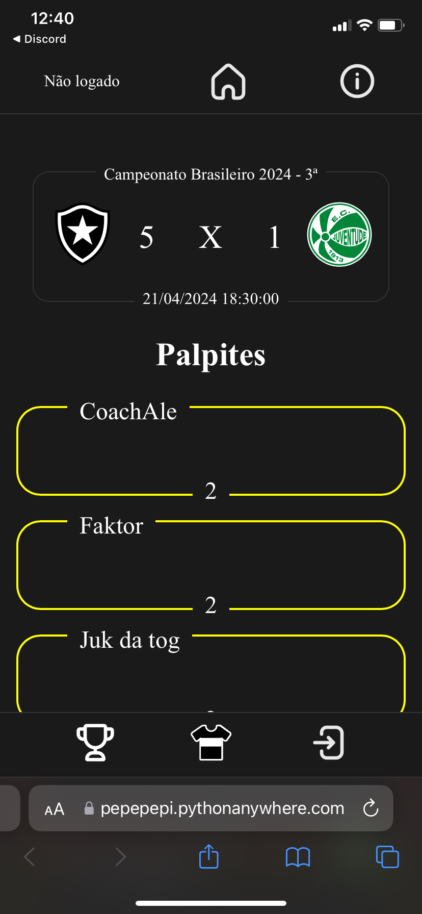

# Palpites de futebol

## Descrição

Este projeto consiste em uma aplicação web que permite que usuários possam palpitar em jogos do Brasileirão. Os palpites são comparados com os resultados reais dos jogos e pontuações são dadas aos usuários de acordo com seus acertos.

Existe um padrão de pontuação nessa implementação:

* Padrão Pepe
    * 1 ponto por acertar quem venceria/empate
    * 1 ponto por acertar gols do time mandante
    * 1 ponto por acertar gols do time visitante
  
Essa pontuação pode acabar levando a empates, para o critério de desempate é levado em consideração a diferença de gols do palpite em relação ao resultado real.

Vamos imaginar um jogo que acabe 4x2, onde o primeiro usuário palpitou 3x1 e o segundo usuário palpitou 2x0. Os dois usuários fizeram 1 único ponto no Padrão, pois ambos só acertaram quem venceu o jogo. No entanto, o primeiro usuário chegou muito mais próximo do resultado real que o segundo usuário. Por isso, a diferença de gols é utilizado como critério de desempate, onde quem tiver a menor diferença de gols ficará a frente dos demais.

Um ranking foi feito com tais pontuações e um gráfico de pontuação de usuários em diferentes rodadas de um campeonato.

Caso deseje ver o site em funcionamento, visite: https://pepepepi.pythonanywhere.com/

## Tecnologias Utilizadas

- Django: Um framework web em Python utilizado para o desenvolvimento do backend da aplicação.
- HTML: Linguagem de marcação utilizada para estruturar a página web.
- CSS: Linguagem de estilização utilizada para definir o visual da página web.
- Chart.js: Uma biblioteca JavaScript utilizada para a criação do gráfico interativo na página web.

## Funcionalidades

- Palpitar nos jogos.
- Exibição de um ranking da pontuação dos usuários em diferentes rodadas do campeonato.
- Filtro de qual rodada deseja ver o ranking.
- Exibição do gráfico de pontuação de usuários em diferentes rodadas do campeonato.
- Filtros para selecionar quais usuários e quais rodadas deseja visualizar no gráfico.
- Grupos de Usuários para um campeonato específico, podendo ter um peso de rodada 

## Instruções de Uso

1. Faça o clone deste repositório para o seu ambiente de desenvolvimento.
2. Execute o servidor Django com o comando `python manage.py runserver`.
3. Acesse a aplicação no navegador utilizando o endereço `http://localhost:8000`.
4. Divirta-se, recomendo que elimine o banco de dados caso vá usar, mas caso queira utilizar este para ver como funciona, o adm tem login e senha: admin

## Estrutura do Projeto

O projeto não está dos mais bem estruturados dado que fiz para me divertir com meus amigos enquanto treinava algumas técnicas.

- `brasileirao/`: Diretório principal do projeto Django e suas configurações.
- `media/`: Diretório onde ficam guardados os escudos dos times, as imagens de perfis dos usuários, os exemplos de temas do site e algumas imagens explicativas do site.
- `palpites`: O único aplicativo Django do projeto. Tudo está ocorrendo nele.
  - `models.py`: Arquivo onde ficam descritos os modelos do banco de dados utilizado
  - `templates/`: Diretório contendo os templates HTML utilizados pela aplicação.
  - `static/`: Diretório contendo os arquivos estáticos da aplicação, como scripts JavaScript, arquivos de estilo CSS, icons.
  - `views.py`: Arquivo contendo as views (controladores) do Django que definem o comportamento da aplicação.
  - `api.py`: Arquivo contendo diversas API's do site.
  - `utils.py`: Arquivo contendo diversas funções que foram utilizadas tanto nas `views.py` quanto na `api.py`
- `sass`: Pasta onde foram colocados os arquivos sass que geram os arquivos .css do projeto.
- `auxiliares`: Pasta onde foi colocado o arquivo que extrai os dados da rodada do campeonato brasileiro.
  
## Melhorias Futuras

O site sempre poderá ter melhorias, então vou listar em ordem do que acho legal de ter:

- Resolução de qualquer bug descoberto;
- Quando acessar um jogo pelo campeonato, ao ir para o jogo anterior ou para o próximo, que este jogo seja o do próprio campeonato e não de tudo;
- Habilitar e-mails a serem algo funcionais;
- Modificação dos times no banco de dados, colocando uma sigla, o nome completo, país de origem, etc;
- Modificação dos campeonatos, permitindo que seja colocado o país de origem ou a organização que é responsável;
- Filtro do usuário para que apareça os campeonatos que ele prefere na página inicial;
- Filtro na página de palpitar para que apareça o campeonato que o usuário quer;
- Criação de códigos automatizados para coleta dos jogos e resultados de cada campeonato (feito para o campeonato brasileiro especificamente, mas deixado em separado no projeto porque o host gratuito não deixa eu fazer a busca por outro site, então tenho que fazer por fora);

- Criação de um aplicativo android;
  
- Criação de um aplicativo para iphones.

## Bugs conhecidos sem solução

- Em Iphone's/Ipad's existe um bug na visualização dos jogos, onde os palpites das pessoas vão para baixo, não se sabe ainda a razão.

## Contribuição

Sinta-se à vontade para contribuir com este projeto abrindo issues ou enviando pull requests. Toda contribuição é bem-vinda!
